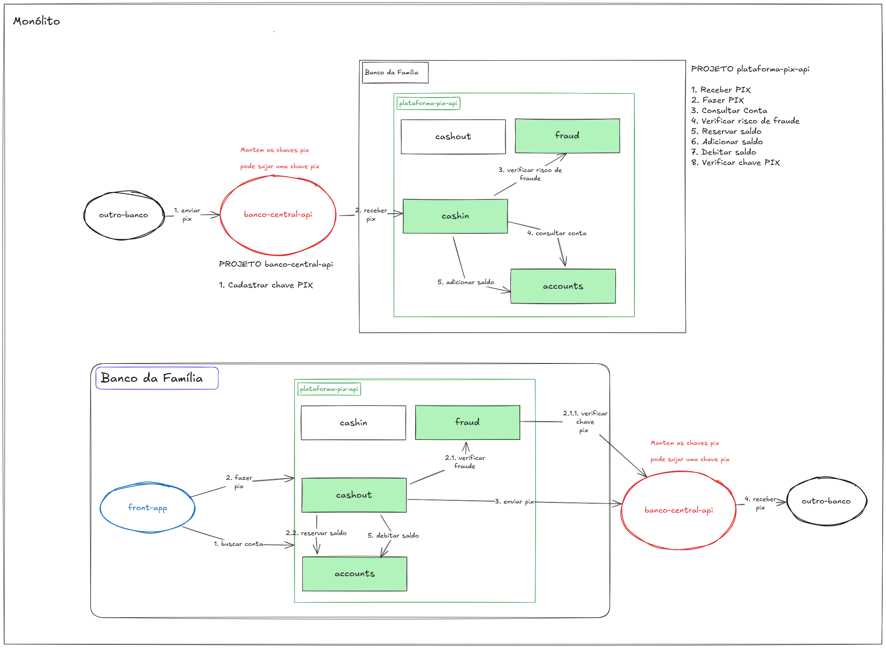

# Plataforma Pix - Banco Família S.A. 🏦

## Visão Geral 🌍

A **Plataforma Pix** é uma API web desenvolvida para o **Banco Família S.A.**, oferecendo funcionalidades robustas para operações de pagamento via Pix. Construída com **Spring Boot** e **Java 17**, a API é projetada para ser amigável a desenvolvedores iniciantes, proporcionando uma oportunidade valiosa para adquirir experiência ao resolver issues e aprimorar o sistema.

## Tecnologias Principais ⚙️

Este projeto utiliza um conjunto de tecnologias modernas para garantir eficiência e escalabilidade:

- **Java 17**: ☕ Linguagem de programação moderna e eficiente.
- **Spring Boot 3.3.5**: 🚀 Framework poderoso para construção de APIs.
- **Spring Data JPA**: 💾 Abstração que simplifica o acesso a dados.
- **PostgreSQL 17**: 🗄️ Sistema de banco de dados relacional robusto.
- **Flyway**: 🦅 Ferramenta para gerenciamento de migrações de banco de dados.
- **OpenFeign**: 🌐 Cliente HTTP declarativo para chamadas a serviços externos.
- **Resilience4J**: 🛡️ Biblioteca para gerenciamento de resiliência em chamadas HTTP.
- **Docker**: 🐳 Solução para containerização de aplicações.
- **WireMock**: 🛠️ Ferramenta para simulação de serviços HTTP, facilitando testes.

## Estrutura de Pacotes 📦

A arquitetura da API é organizada em camadas (layers), o que separa responsabilidades e facilita a manutenção:

- **Controller**: 🎮 Controladores REST que expõem os endpoints da API.
- **Service**: 🔧 Lógica de negócios e orquestração de chamadas aos repositórios.
- **Entity**: 🏛️ Entidades JPA que representam as tabelas do banco de dados.
- **DTO (Data Transfer Object)**: 📨 Objetos usados para transferir dados entre camadas.
- **VO (Value Object)**: 📦 Objetos imutáveis que representam valores.
- **Repository**: 📚 Interfaces que estendem `JpaRepository` para acesso a dados.

## Acessando o WireMock e o pgAdmin 🔧

### WireMock

O WireMock simula serviços HTTP e está configurado para rodar na porta `8081`. Para acessar a interface do WireMock, use o seguinte URL:

```
http://localhost:8081/__admin/webapp/
```

### pgAdmin

O pgAdmin é uma ferramenta de gerenciamento para o banco de dados PostgreSQL, rodando na porta `16543`. Acesse a interface do pgAdmin pelo seguinte URL:

```
http://localhost:16543
```

**Credenciais de acesso**:
- **Email**: `postgres@pix.br`
- **Senha**: `postgres`

## Executando o Docker Compose 🚀

Para iniciar os serviços Docker, incluindo PostgreSQL, pgAdmin e WireMock, execute o seguinte comando na raiz do projeto:

```bash
docker-compose up -d
```

Este comando inicia os containers em segundo plano. Para parar os containers, use:

```bash
docker-compose down
```

## Objetivo do Projeto 🎯

O projeto foi intencionalmente estruturado de forma a não seguir algumas das melhores práticas de desenvolvimento. O intuito é criar issues que permitam a programadores novatos adquirir experiência ao resolver problemas e melhorar o sistema. A expectativa é que, ao final, o sistema esteja em conformidade com boas práticas de desenvolvimento, incluindo:

- **Clean Code**: Código claro e fácil de entender, seguindo princípios que tornam o software mais legível e manutenível.
- **SOLID**: Conjunto de cinco princípios para design de software que ajudam a manter o código limpo e estruturado.
    - **S**: Single Responsibility Principle (Princípio da Responsabilidade Única).
    - **O**: Open/Closed Principle (Aberto para extensão, fechado para modificação).
    - **L**: Liskov Substitution Principle (Substituição de Liskov).
    - **I**: Interface Segregation Principle (Segregação de Interface).
    - **D**: Dependency Inversion Principle (Inversão de Dependência).
- **DRY (Don't Repeat Yourself)**: Evitar repetição desnecessária de código, mantendo a lógica centralizada.
- **KISS (Keep It Simple, Stupid)**: Manter o design do software simples e direto, sem adicionar complexidade desnecessária.
- **Object Calisthenics**: Práticas para melhorar a qualidade do código por meio de regras que ajudam na orientação a objetos.
- **Big O Notation**: Análise da complexidade de algoritmos para entender a eficiência do código em termos de tempo e espaço.

Desenvolvedores são incentivados a contribuir com melhorias e a seguir essas práticas ao resolver issues e implementar novas funcionalidades.

## Contribuição 🤝

Contribuições são bem-vindas! Sinta-se à vontade para abrir issues ou enviar pull requests para melhorias ou novas funcionalidades. Juntos, podemos fazer da Plataforma Pix um sistema ainda melhor!

## Arquitetura do Sistema 🏗️

A arquitetura do sistema é visualizada no diagrama abaixo, que ilustra a interação entre os componentes do Banco da Família e o Banco Central para a realização das operações PIX.



## Chamadas cURL 📞

As seguintes chamadas cURL correspondem às requisições disponíveis na coleção do Insomnia:

### 1. Recebimento PIX
```bash
curl -X POST http://localhost:8080/pix/v1/receive -H "Content-Type: application/json" -d '{
  "transacaoId": "UUID-gerado",
  "valor": "valor-gerado",
  "criadoEm": "2024-11-04T00:00:00Z",
  "origem": {
    "chavePix": "cpf",
    "nome": "",
    "banco": {
      "nome": "Banco Brasil",
      "agencia": "00001",
      "conta": "4321",
      "digito": "0"
    }
  },
  "destino": {
    "chavePix": ""
  }
}'
```

### 2. Consulta conta cliente
```bash
curl -X GET "http://localhost:8080/pix-api/v1/contas?chavePix=111&cpf=00011122233" -H "User-Agent: insomnia/10.1.1"
```

### 3. Consulta chave destinatário PIX
```bash
curl -X GET "http://localhost:8080/pix-api/v1/chaves?chave_pix=111" -H "User-Agent: insomnia/10.1.1"
```

### 4. Verificação risco fraude
```bash
curl -X GET "http://localhost:8080/pix-api/v1/fraudes/verificacao-risco/chave-pix?chavePIx=111" -H "User-Agent: insomnia/10.1.1"
```

### 5. Envio PIX
```bash
curl -X POST http://localhost:8080/pix-api/v1/pix/ -H "Content-Type: application/json" -d '{
  "transacaoId": "UUID-gerado",
  "valor": "valor-gerado",
  "criadoEm": "2024-11-04T00:00:00Z",
  "origem": {
    "chavePix": "cpf",
    "nome": "",
    "banco": {
      "nome": "Banco Família",
      "agencia": "00001",
      "conta": "4321",
      "digito": "0"
    }
  },
  "destino": {
    "chavePix": ""
  }
}'
```

### 6. Cria conta cliente
```bash
curl -X POST http://localhost:8080/pix-api/v1/conta -H "Content-Type: application/json" -d '{
  "nome": "Nome do Cliente",
  "chavePix": {
    "chave": "cpf",
    "tipo": "0" // 0=CPF; 1=CNPJ
  }
}'
```

### 7. Adiciona saldo cliente
```bash
curl -X POST "http://localhost:8080/pix-api/v1/contas?contaId=111" -H "Content-Type: application/json" -d '{ "valor": 10.0 }'
```

### 8. Remove saldo cliente
```bash
curl -X POST http://localhost:8080/pix-api/v1/conta -H "Content-Type: application/json" -d '{
  "nome": "Nome do Cliente",
  "chavePix": {
    "tipo": "0",
    "chave": "cpf"
  }
}'
```

### 9. Consulta saldo cliente
```bash
curl -X GET "http://localhost:8080/pix-api/v1/conta/550e8400-e29b-41d4-a716-446655440000/saldo" -H "User-Agent: insomnia/10.1.1"
```

### 10. Consultar chave PIX
```bash
curl -X GET "http://localhost:8081/__admin/webapp/bancocentral-api/v1/chaves?chaveId=00961480122" -H "User-Agent: insomnia/10.1.1"
```

### 11. Envia PIX para Banco Família (WireMock)
```bash
curl -X POST http://localhost:8081/__admin/webapp/pix/v1/send -H "User-Agent: insomnia/10.1.1"
```

---

**Banco Família S.A.** - Conectando você ao futuro dos pagamentos! ✨
**[Baixar Insomnia](https://insomnia.rest/download)**
